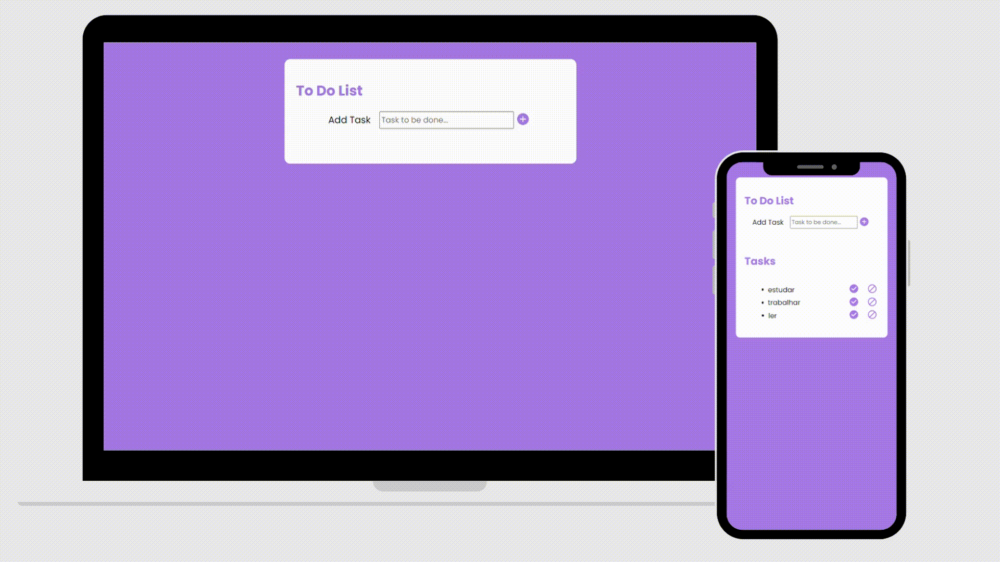

    

## 💻 Projeto
Esse é um projeto Web de uma lista de tarefas, onde é possível adicionar a tarefa desejada, riscá-la ao cumprir ou deletar.

## 🚀 Tecnologias
Esse projeto foi desenvolvido utilizando:
- HTML
- CSS
- JavaScript básico